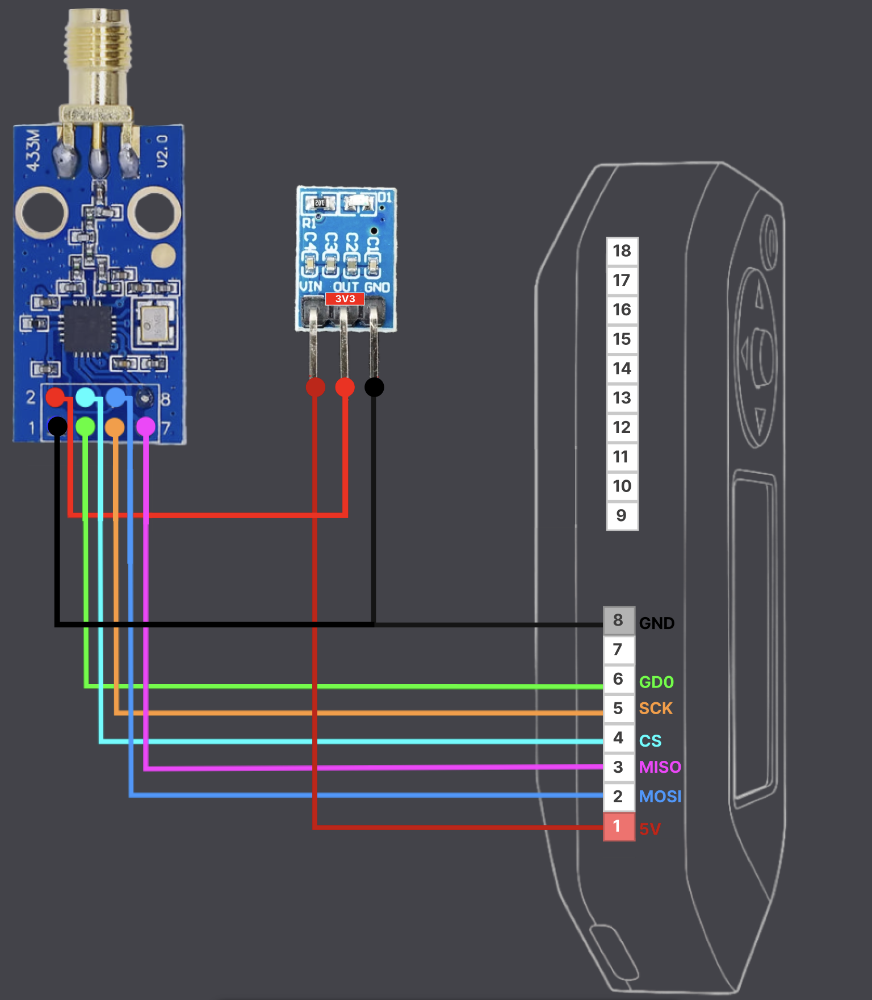
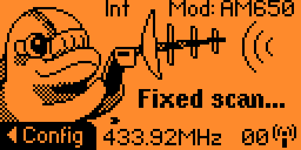
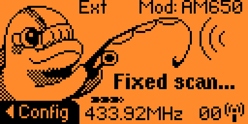
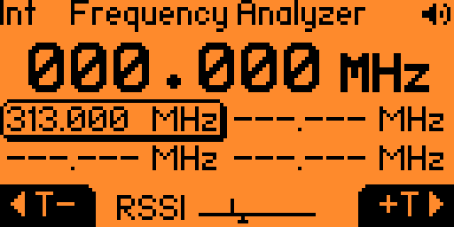
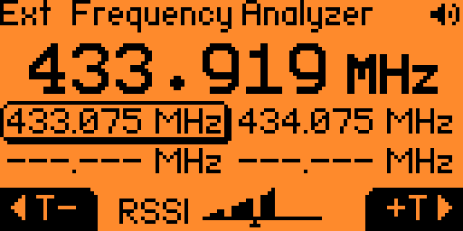

# How to Connect an External CC1101 Module at 5V

This external module is based on the work of [quen0n](https://github.com/quen0n/flipperzero-ext-cc1101). This version is designed to be powered directly via the **5V from the Flipper Zero**, allowing for a **more discreet integration** using only the **first row of 8 pins** on the Flipper.

---

<table>
  <tr>
    <td>

### Pin Connections

| **Flipper Zero** | **LDO** | **CC1101** |
|-----------------|---------|-----------|
| 1               | VIN->OUT| VCC       |
| 2               |         | MOSI      |
| 3               |         | MISO      |
| 4               |         | CS        |
| 5               |         | SCK       |
| 6               |         | GDO       |
| 8               | GND     | GND       |

  </td>
    <td>
      
    </td>
  </tr>
</table>

---

## Proposed Assembly

  
  

### Legend:
- 🔴 : **OUT LDO**
- 🔵 : **GND LDO**
- 🟡 : **GND CC1101** *(linked with GND LDO)*

**Tip**: Protect the connections with **solder mask** to avoid unwanted contacts.
**Recommended Wire**: **24AWG** solid core copper.

---

## Component References

| **Component** | **Specifications** |
|--------------|-------------------|
| **LDO**      | AMS117 **5V → 3.3V** (800 mA) |
| **CC1101**   | **433 MHz** Module +10 dBm |

---

## ⚠️ Important Notes

- Make sure to **convert the 5V to 3.3V** using an **LDO regulator** to avoid damaging the CC1101.
- If the Flipper crashes during the 'read' function and your connections are correct, the CC1101 might be defective.
- The module should be detected as soon as you enter the **`Sub-Ghz`** menu.
- To verify this, go to the settings:
  **`menu -> Sub-GHz -> Radio Settings`** the **`Module`** should be **`External`**.

---

## Comparative Tests

| Mode                | Internal                                                                 | External                                                                 |
|---------------------|--------------------------------------------------------------------------|--------------------------------------------------------------------------|
| **Read**            | 

                   | 

                   |
| **Frequency Analyser** | 

               | 

               |

Tests generally show:
- Better reception range
- More accurate frequency range